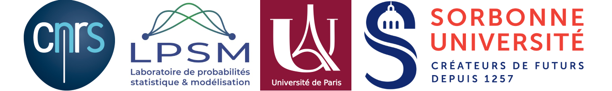

Welcome to the website of the one-day workshop "[Regularisation for Inverse Problems and Machine Learning](https://invprob-ml-workshop.github.io/)", which will be held at the [Campus Jussieu](https://goo.gl/maps/AgoULSsBeL2beaZo7) (room 16-26-209) in Paris on November 19th 2019.

---------------------------
*Due to room limitations, **the inscriptions are now CLOSED**. If you wish you can ask for being placed in a waiting list [here](#registration).* 

---------------------------

## What is this workshop about

The purpose of the workshop is to gather together people working on problems arising in different fields such as imaging, machine learning and inverse problems theory in order to underline similarities and differences of the regularisation approaches used  (Tikhonov, early stopping, implicit regularization...).

## Program

All the talks will be held in the room 16-26-209. Coffee breaks and lunch will be organized in the room 15-25-202

- 09h45-10h15 Welcome Coffee :coffee::cookie:
- 10h15-11h00 Talk by [Martin Benning](https://www.qmul.ac.uk/maths/profiles/benningmartin.html) *(Queen Mary University of London)* 
  **Title**: Deep learning as optimal control problems 
  

  
<b>Abstract:</b> <i>(click to unroll)</i>

  

  We consider recent works where deep neural networks have been interpreted as discretisations of an optimal control problem subject to an ordinary differential equation constraint. We review the first order conditions for optimality, and the conditions ensuring optimality after discretisation. This leads to a class of algorithms for solving the discrete optimal control problem which guarantee that the corresponding discrete necessary conditions for optimality are fulfilled. The differential equation setting lends itself to learning additional parameters such as the time discretisation. We explore this extension alongside natural constraints (e.g. time steps lying in a simplex) and compare these deep learning algorithms numerically in terms of induced flow and generalisation ability. We conclude by addressing the interpretation of this extension as iterative regularisation methods for inverse problems. This is joint work with Elena Celledoni, Matthias J. Ehrhardt, Brynjulf Owren and Carola-Bibiane Schönlieb.
  

  

- 11h00-11h45 Talk by [Silvia Villa](http://lcsl.mit.edu/data/silviavilla/Home.html) *(Universitá di Genova)* 
  **Title**: Stability and regularization properties of diagonal proximal gradient methods 
  

  
<b>Abstract:</b> <i>(click to unroll)</i>

  

  Many applied problems in science and engineering can be modeled as noisy inverse problems. Tackling these problems requires to dealwith their possible ill-posedness and to devise efficient numerical procedures to quickly and accurately compute a solution. In this context, Tikhonov regularization is a classical approach. A solution is defined by the minimization of an objective function beingthe sum of two terms: a data-fit term and a regularizer ensuring stability. However, in practice, finding the best Tikhonov regularized solutionrequires specifying a regularization parameter determining the trade-off between data-fit and stability. From a numerical perspective, this can dramatically increase the computational costs to find a good solution. In this talk, I will present an alternative approach based on iterative regularization techniques. The latter are classical regularization methods basedon the observation that stopping an iterative procedure corresponding to the minimization of an empirical objective has a self-regularizing property. Crucially, the number of iterations becomes the regularization parameter, and hence controls at the same time the accuracy of the solution as well as the computational complexity of the method, making parameter tuning numerically efficient and iterative regularization an alternative to Tikhonov regularization. I will present  general iterative regularization methods allowing to consider large classes of data-fit terms and regularizers, based on proximal and gradient descent steps. The proposed analysis establishes convergence as well as stability results.
  

  

- 11h45-12h30 Talk by [Martin Burger](https://en.www.math.fau.de/applied-mathematics-prof-burger/) *(FAU Erlangen-Nürnberg)* 
  **Title**: Implicit regularization in machine learning: a perspective from iterative regularization theory 
  

  
<b>Abstract:</b> <i>(click to unroll)</i>

  

  In this talk we will approach the implicit regularization properties found when applying (stochastic) gradient descent to empirical risk minimization problems ( e.g. in deep learning) with the paradigms of regularization theory in inverse problems. We will demonstrate the decrease of the population risk up to a specific error, which can be estimated in optimal transport metrics. We will discuss the analogy of such properties to the classical discrepancy principle in iterative regularization.
  

  

- 12h30-14h00 Lunch (Buffet) :fork_and_knife::hamburger:
- 14h00-14h45 Talk by [Lorenzo Rosasco](http://web.mit.edu/lrosasco/www/) *(LCSL, Universitá di Genova, MIT, IIT)* 
  **Title**: Not so fast: learning with accelerated optimization  
  

  
<b>Abstract:</b> <i>(click to unroll)</i>

  

  The focus on optimization is a major trend in modern machine learning. In turn, a number of optimization solutions have been recently developed and motivated by machine learning applications. However, most optimization guarantees focus on the training error, ignoring the performance at test time which is the real goal in machine learning. In this talk, take steps to fill this gap in the context of least squares learning. We analyze the learning (test) performance of accelerated  gradient methods. In particular, we discuss the influence of  different learning assumptions on the corresponding rates.
  

  

- 14h45-15h30 Talk by [Marie-Caroline Corbineau](https://hal.archives-ouvertes.fr/search/index/q/*/authIdHal_s/marie-caroline-corbineau) *(CentraleSupélec, Université Paris-Saclay)* 
  **Title**: Deep Unfolding of a Proximal Interior Point Method for Image Restoration  
  

  
<b>Abstract:</b> <i>(click to unroll)</i>

  

  Variational methods are widely applied to ill-posed inverse problems for they have the ability to embed prior knowledge about the solution. However, the level of performance of these methods significantly depends on a set of parameters, which can be estimated through computationally expensive and time-consuming methods. In contrast, deep learning offers very generic and efficient architectures, at the expense of explainability, since it is often used as a black-box, without any fine control over its output. Deep unfolding provides a convenient approach to combine variational-based and deep learning approaches. Starting from a regularized variational formulation for image restoration, we develop iRestNet, a neural network architecture obtained by unfolding a proximal interior point algorithm. Hard constraints, encoding desirable properties for the restored image, are incorporated into the network thanks to a logarithmic barrier, while the barrier parameter, the stepsize, and the penalization weight are learned by the network. We derive explicit expressions for the barrier proximity operator and its gradient for three types of constraints, which allows training iRestNet with gradient descent and backpropagation. In addition, we provide theoretical results regarding the stability of the network for a common inverse problem example. Numerical experiments on image deblurring problems show that the proposed approach compares favorably with both state-of-the-art variational and deep learning methods in terms of image quality. 
  

  

- 15h30-16h00 Coffee break :coffee:
- 16h00-16h45 Talk by [Gilles Blanchard](https://www.ihes.fr/professeur/gilles-blanchard-2/) *(Université Paris-Sud, Université Paris-Saclay)* 
  **Title**: Simultaneous adaptation for several criteria using an extended Lepskii principle  
  

  
<b>Abstract:</b> <i>(click to unroll)</i>

  

  In the setting of supervised learning, we propose a data-dependent regularization parameter selection rule that is adaptive to the unknown regularity of the target function and is optimal both for the least-square (prediction) error and for the reproducing kernel Hilbert space (reconstruction) norm error. It is based on a modified Lepskii balancing principle using a varying family of norms.
  

  

## Location

The workshop will be held at the Campus Jussieu in Paris.

Finding Jussieu in Paris  |  Finding the workshop in Jussieu
:---------------------------:|:-------------------------:
 |  

 

- [Jussieu](https://goo.gl/maps/AgoULSsBeL2beaZo7) can be accessed via the Metro lines 7 and 10. Line 7 connects to the RER B (Gare du Nord, Airport Charles de Gaulle) at Châtelet.
- In Jussieu, get to the 2nd floor by taking the stairs/elevator through the (numbered) towers. Talks will be in the room 209 (between towers 16-26), coffee and lunch will be served in room 202 (15-25).

## Organization

- [Luca Calatroni](https://sites.google.com/view/lucacalatroni/home) (calatroni 'at' i3s.unice.fr) Chargé de Recherche (CNRS) à  l'Université Nice Sophia Antipolis.
- [Guillaume Garrigos](http://www.guillaume-garrigos.com/) (guillaume.garrigos 'at' lpsm.paris) Maître de Conférences à l'Université de Paris.

## Support

This workshop is supported by the CNRS through the INSMI PEPS JCJC project "Efficient iterative regularization for inverse problems and machine learning" (EFIR).

## Registration

Due to room limitations, the inscriptions are now closed. If you wish you can ask for being placed in a waiting list by using the form below. If you encounter any issues, you can instead follow this [link](https://docs.google.com/forms/d/e/1FAIpQLScLQ1fnfXiqSfhNNlLi9YM4WdvArePn_cu-IC-Qb0kvvJhD8A/viewform?usp=sf_link).

<iframe src="https://docs.google.com/forms/d/e/1FAIpQLScLQ1fnfXiqSfhNNlLi9YM4WdvArePn_cu-IC-Qb0kvvJhD8A/viewform?embedded=true" width="640" height="1065" frameborder="0" marginheight="0" marginwidth="0">Chargement…</iframe>

