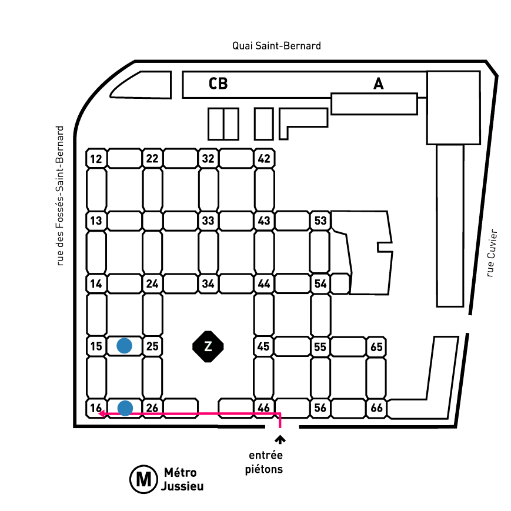

Welcome to the website of the one-day workshop "[{{ site.title }}](https://invprob-ml-workshop.github.io/)", which will be held at the [Campus Jussieu](https://goo.gl/maps/AgoULSsBeL2beaZo7) (room 16-26-209) in Paris on November 19th 2019.

---------------------------
The Workshop is now done, thanks to everyone participating. All the slides of the presentations are available, see the [program](https://invprob-ml-workshop.github.io/#program).

---------------------------

## What is this workshop about

The purpose of the workshop is to gather together people working on problems arising in different fields such as imaging, machine learning and inverse problems theory in order to underline similarities and differences of the regularisation approaches used  (Tikhonov, early stopping, implicit regularization...).

## Program

All the talks will be held in the room 16-26-209. Coffee breaks and lunch will be organized in the room 15-25-202.



## Location

The workshop will be held at the Campus Jussieu in Paris.

Finding Jussieu in Paris  |  Finding the workshop in Jussieu
:---------------------------:|:-------------------------:
 |  

 

- [Jussieu](https://goo.gl/maps/AgoULSsBeL2beaZo7) can be accessed via the Metro lines 7 and 10. Line 7 connects to the RER B (Gare du Nord, Airport Charles de Gaulle) at Châtelet.
- In Jussieu, get to the 2nd floor by taking the stairs/elevator through the (numbered) towers. Talks will be in the room 209 (between towers 16-26), coffee and lunch will be served in room 202 (15-25).

## Organization

- [Luca Calatroni](https://sites.google.com/view/lucacalatroni/home) (calatroni 'at' i3s.unice.fr) Chargé de Recherche (CNRS) à  l'Université Nice Sophia Antipolis.
- [Guillaume Garrigos](http://www.guillaume-garrigos.com/) (guillaume.garrigos 'at' lpsm.paris) Maître de Conférences à l'Université de Paris.

## Support

This workshop is supported by the CNRS through the INSMI PEPS JCJC project "Efficient iterative regularization for inverse problems and machine learning" (EFIR), and the [GdR Mathématiques de l'Optimisation et Applications](http://gdrmoa.math.cnrs.fr/).

## Registration

Due to room limitations, the inscriptions are now closed. 

## List of Participants



